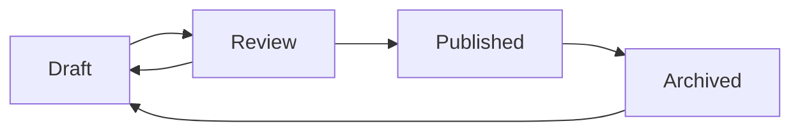

# Content Management

Learn how to create, manage, and organize content in SonicJS AI.

## Understanding Content Types

SonicJS AI supports flexible content types that can be customized for your needs:

### Built-in Content Types

- **Pages** - Static pages like About, Contact, etc.
- **Posts** - Blog posts, news articles, and time-based content
- **Media** - Images, videos, documents, and other files

### Custom Content Types

You can define custom content types by extending the base schema:

```typescript
// Example: Product content type
export const productSchema = z.object({
  title: z.string().min(1),
  description: z.string(),
  price: z.number().positive(),
  category: z.string(),
  inStock: z.boolean().default(true),
  images: z.array(z.string()).optional()
})
```

## Creating Content

### Using the Admin Interface

1. **Navigate to Content** - Go to `/admin/content` in your browser
2. **Click "New Content"** - Start creating a new content item
3. **Fill in Details**:
   - **Title**: The main title of your content
   - **Slug**: URL-friendly identifier (auto-generated from title)
   - **Content Type**: Select the appropriate type
   - **Status**: Draft, Published, or Archived
   - **Content**: Rich text content with markdown support

4. **Save or Publish** - Save as draft or publish immediately

### Using the API

Create content programmatically using the REST API:

```javascript
const response = await fetch('/api/content', {
  method: 'POST',
  headers: {
    'Content-Type': 'application/json',
    'Authorization': `Bearer ${token}`
  },
  body: JSON.stringify({
    title: 'My New Article',
    slug: 'my-new-article',
    type: 'post',
    content: '# Welcome\n\nThis is my first article...',
    status: 'published'
  })
})

const newContent = await response.json()
```

## Content Status Workflow

SonicJS AI supports a flexible content workflow:

- **Draft** - Work in progress, not visible to public
- **Published** - Live and visible to everyone
- **Archived** - Hidden but preserved for reference

### Publishing Workflow



## Rich Text Editing

The admin interface includes a powerful markdown editor with:

### Features
- **Live preview** - See formatted content as you type
- **Syntax highlighting** - Code blocks with syntax highlighting
- **Media insertion** - Drag and drop images directly
- **Table support** - Create and edit tables easily
- **Link management** - Easy linking to internal and external content

### Markdown Support

```markdown
# Headers
## Subheaders

**Bold text** and *italic text*

- Bulleted lists
- With multiple items

1. Numbered lists
2. Also supported

[Links](https://example.com) and 

`Inline code` and:

```
Code blocks
with syntax highlighting
```

> Blockquotes for emphasis

| Tables | Are | Supported |
|--------|-----|-----------|
| Row 1  | A   | 123       |
| Row 2  | B   | 456       |
```

## Content Organization

### Collections

Group related content into collections:

- **Blog Posts** - All your blog articles
- **Products** - E-commerce product catalog
- **Team Members** - Staff profiles and bios
- **Testimonials** - Customer reviews and feedback

### Tagging and Categorization

Organize content with:
- **Categories** - Hierarchical organization
- **Tags** - Cross-cutting labels and keywords
- **Custom Fields** - Additional metadata specific to your needs

### Search and Filtering

The admin interface provides powerful search capabilities:

```typescript
// API search example
const results = await fetch('/api/content?search=tutorial&type=post&status=published')
```

## Media Management

### File Uploads

Support for various file types:
- **Images** - JPG, PNG, GIF, WebP
- **Documents** - PDF, DOC, DOCX, TXT
- **Videos** - MP4, WebM, MOV
- **Audio** - MP3, WAV, OGG

### Image Processing

Automatic image optimization:
- **Resizing** - Multiple sizes for different use cases
- **Compression** - Optimized file sizes
- **Format conversion** - WebP for modern browsers
- **CDN delivery** - Fast global content delivery

### Media in Content

Reference media files in your content:

```markdown


[Download PDF](/media/def456/document.pdf)
```

## Content Versioning

Track changes to your content:

### Version History
- **Automatic saving** - All changes are tracked
- **Rollback capability** - Restore previous versions
- **Change comparison** - See what changed between versions
- **Audit trail** - Track who made changes and when

### Example Usage

```javascript
// Get version history
const versions = await fetch('/api/content/123/versions')

// Restore a previous version
await fetch('/api/content/123/restore/5', { method: 'POST' })
```

## Best Practices

### Content Strategy
1. **Plan your content types** before you start creating content
2. **Use consistent naming** for categories and tags
3. **Write SEO-friendly titles** and descriptions
4. **Organize with clear hierarchies** using collections

### Performance Tips
1. **Optimize images** before uploading
2. **Use appropriate content types** for better organization
3. **Regular content audits** to remove outdated material
4. **Leverage caching** for frequently accessed content

### Security Considerations
1. **Review content** before publishing
2. **Use proper user permissions** for content creation
3. **Validate user inputs** in custom content types
4. **Monitor content changes** through audit logs

## Advanced Features

### Custom Fields

Extend content types with custom fields:

```typescript
export const eventSchema = z.object({
  title: z.string(),
  content: z.string(),
  startDate: z.string().datetime(),
  endDate: z.string().datetime(),
  location: z.string(),
  maxAttendees: z.number().optional(),
  registrationRequired: z.boolean()
})
```

### Content Relationships

Link related content:

```javascript
{
  "title": "Advanced JavaScript",
  "content": "...",
  "relatedPosts": ["post-123", "post-456"],
  "author": "user-789"
}
```

### Scheduled Publishing

Set content to publish automatically:

```javascript
{
  "title": "Weekly Newsletter",
  "content": "...",
  "status": "scheduled",
  "publishAt": "2024-02-01T09:00:00Z"
}
```

## Troubleshooting

### Common Issues

**Content not saving:**
- Check your authentication token
- Verify required fields are filled
- Ensure you have proper permissions

**Images not displaying:**
- Verify file upload was successful
- Check file path and permissions
- Ensure proper image formats

**Rich text editor issues:**
- Clear browser cache
- Check for JavaScript errors
- Try refreshing the page

Need more help? Check our [FAQ](/docs/faq) or [contact support](mailto:support@sonicjs.com). 